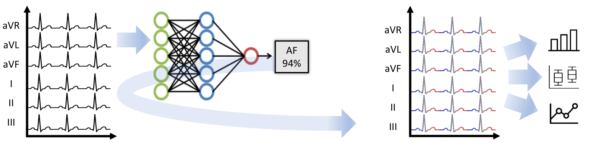

# XAI ECG

Running iNNvestigate methods on Ribeiro model (https://doi.org/10.5281/zenodo.3625017)

## Name
Analysis of a deep learning model for 12-lead ECG classification with XAI methods

## Description
Despite their remarkable performance, deep neural networks remain unadopted in clinical practice, which is considered to be partially due to their lack in explainability.
With this toolbox you can classify data from a public data set and assign a ”relevance score” to each sample of the classified signal with XAI attribution methods. This allows analyzing what the network learned during training, for which we provide quantitative visualizations: average relevance scores over classes, leads, and average beats.

## Project Structure
- **`data`**
    - `ecg_tracings.hdf5`: Ribeiro test data
    - `model.hdf5`: Ribeiro DNN
    - `*.csv`: results from Ribeiro publication, including ground truths
- **`tmp`**: results from `analysis.py`, to be loaded in `visualization_notebook.ipynb`
- `analysis.py`: analysis of ECG data with Ribeiro DNN and XAI methods
- `ecgdata.py`: functions to load ECG data from various sources
- `requirements.txt`: requirements to run `visualization_notebook.ipynb`
- `ribeiro.py`: functions to analyze ECG data with Ribeiro DNN
- `visualization.py`: functions to plot relevance scores and supporting data
- `visualization_notebook.ipynb`: visualize data generated with `analysis.py`
- `xai.py`: functions to run XAI methods based on iNNvestigate library

## Installation
Tested on Windows 10:
- install Python 3.6
- `pip install tensorflow==1.12.0`
- `pip install 'h5py==2.10.0' --force-reinstall` (to avoid AttributeError: 'str' object has no attribute 'decode')
- `pip install matplotlib`
- `pip install pydicom>=2.1`
- `pip install pyCompare`
- download CPSC2018 data set to `./data/Training_WFDB/` from https://storage.cloud.google.com/physionet-challenge-2020-12-lead-ecg-public/PhysioNetChallenge2020_Training_CPSC.tar.gz

## Usage
Run `analysis.py` to analyze a data set with the Ribeiro model and compute relevance scores. Data set, XAI method, DNN class and cohort size can be adjusted in this file. All relevant data is stored in one `.mat`-file.

Open `visualization_notebook.ipynb`in Jupyter to visualize the results of `analysis.py`. CPSC2018 and PTB-XL data is already available for visualization in `tmp\`.

## Support
Please contact the authors via email.

## Roadmap
tba

## Contributing
tba

## Authors and acknowledgment
Theresa Bender, theresa.bender@med.uni-goettingen.de \
Nicolai Spicher, nicolai.spicher@med.uni-goettingen.de \
Dagmar Krefting, dagmar.krefting@med.uni-goettingen.de

## License
GNU GPL v3.0

## Project status
Article submitted

